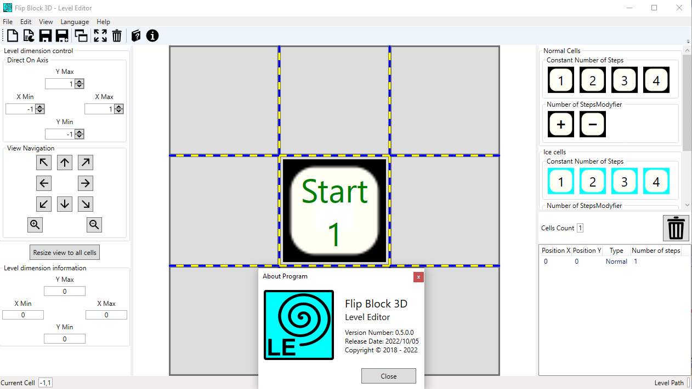
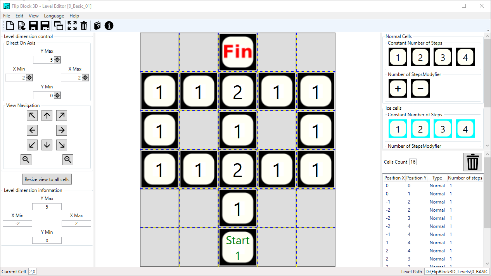
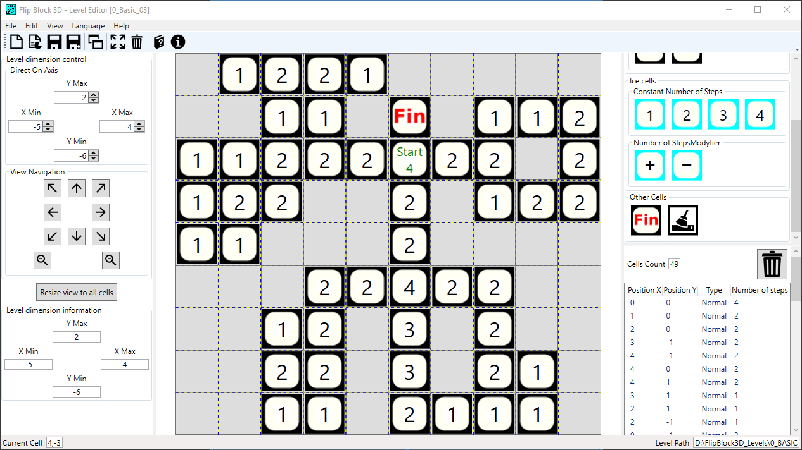

# FlipBlock3D - LevelEditor
It is a user-friendly tool for preparing levels for the Unity game: Flip Block 3D. The source code of this game you can find here: https://github.com/bertekg/FlipBlock3D_Game.

## Screenshots

### 1. Empty project and 'About Program' window

### 2. Level Basic 1

### 3. Level Basic 3
